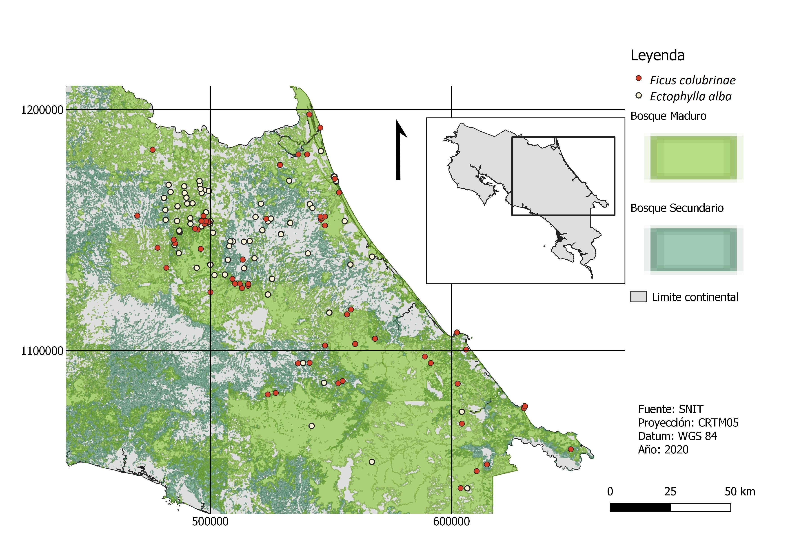

## 1. Pregunta específica de investigación

La especialización de la dieta puede influir en el rendimiento ecológico de *Ectophylla alba*, el cual se alimenta principalmente del fruto de *Ficus colubrinae*; además de que posiblemente la fragmentación de bosques influencie su distribución espacial, por las características propias de la especie. E. alba se encuentra dentro de la lista roja según la IUCN (IUCN) en la categoría de casi amenazado (Rodriguez-Herrera & Pineda, 2015). Por lo que se plantea la pregunta ¿Cómo influye la presencia de árboles de *Ficus colubrinae* en la distribución biogeográfica de *Ectophylla alba* en Costa Rica?


## 2. Variables relevantes

Se tiene la distribucion del F. colubrinae como la variable causa y la distribucion del E. alba como variable respuesta. Ademas se sabe que la distribucion de heliconia tambien se relaciona con la distribucion de E alba, ya que este murcielago usa sus hojas para construir refugio. Sin embargo no se tienen datos de esta variable, por lo que se tomo como una variable no observable. 

```{r, warning=FALSE, message=FALSE}
library(dagitty)
library(ggdag)

# crear DAG

g <- dagitty("dag{
x -> y ; z -> y
x [exposure]
y [outcome]
z [unobserved]
}")

#Graficar el dag

ggdag(g, layout = "circle") + theme_dag()

```

## 3. ¿De donde vienen los datos?

Se obtuvieron datos para F. colubrinae y E. alba mediante dos repositorios de datos: Infraestructura Mundial de Información en Biodiversidad (GBIF) (GBIF.org, 2020) y el Catálogo del Museo Nacional de Costa Rica (Museo Nacional de Costa Rica, 2020). Ambos repositorios son muestras de museos y herbarios, y cuentan con información sobre el individuo en el momento de la colecta. Se utilizaron únicamente los datos con coordenadas geográficas, o con suficiente información en la descripción del lugar como para otorgarle coordenadas geográficas de forma manual. En el caso de E. alba también se utilizaron datos brindados por el Programa para la Conservación de los Murciélagos de Costa Rica (PCMCR) de sus conteos navideños. Se realizaron mapas para identificar los patrones de distribución y verificar que las muestras se encontraran en su rango natural, para así disminuir el margen de error en la digitalización de los datos. Los datos de F. colubrinae tenian datos de la vertiente del Pacifico, por lo que se realizo manualmente una base de datos con unicamente los datos que correspondian al Caribe, ademas de los de E. alba que se comprobo que estaban en su rango natural. 

## 4. Análisis de los datos

Se realiza un Test de Mantel-Haenszel para matrices iguales, utilizando un coeficiente de correlación de Pearson y 999 permutaciones. Esta prueba consiste en estimar si hay o no correlación, ya sea positiva o negativa, entre dos conjuntos de datos de distancias, en este caso, matrices.


Cargar los datos
```{r, warning=FALSE}
#Cargar datos de E. alba
library(readr)
alba <- read_delim("C:/Users/MASTER/Desktop/Proyecto_finalP/Proyecto-final/R/E.alba.csv", 
                   ";", escape_double = FALSE, col_types = cols(Especie = col_factor(levels = c("Ectophylla_alba")), 
                                                                LatitudDecimal = col_number(), LongitudDecimal = col_number()), 
                   trim_ws = TRUE)


#Cargar datos de F. colubrinae
colu <- read_delim("C:/Users/MASTER/Desktop/Proyecto_finalP/Proyecto-final/R/F.colubrinae.csv", 
                   ";", escape_double = FALSE, col_types = cols(Especie = col_factor(levels = c("Ficus_colubrinae")), 
                                                                LatitudDecimal = col_number(), LongitudDecimal = col_number()), 
                   trim_ws = TRUE)
```

Se realizan las matrices para cada variable
```{r, warning=FALSE}
#Matriz para E. alba
a <- matrix(alba$LatitudDecimal, alba$LongitudDecimal, nrow = 124, ncol = 124)

#Matriz para F. colubrinae
c <- matrix(colu$LatitudDecimal, colu$LongitudDecimal, nrow = 124, ncol = 124)
```

Se realizan las pruebas de mantel 

```{r, warning=FALSE, message=FALSE}
library (vegan)

mantel.Ecto <-mantel(a, c, method = "pearson", permutations = 999)
mantel.Ecto

```

## Interpretacion de resultados

Al realizar el Test de Mantel-Haenszel para matrices iguales, se obtuvo un coeficiente de correlacion positivo, sin embargo el nivel de significancia fue mayor a 0.05 (r estadístico de Mantel: 0.01779 , significancia: p>0.05; permutaciones= 999). Al tener un valor de r positivo, se interpreta que la correlacion entre las dos variables es directamente proporcional, sin embargo el pvalue nos indica que esta correlacion no es significativa. Esta falta de significancia se puede deber a la falta de relacion entre los datos, ya que al ser datos de diferentes bases limita el estudio en cuanto a la conectividad que se le pueda dar a ambas especies. Es posible que la base datos de F. colubrinae omitiera a muchos individuos presentes en la zona, esto crea un sesgo, pues no se contemplan individuos que puedan esclarecer la relación y dinámica entre ambas especies. Esto se puede argumentar en que la mayoría de las ubicaciones de F. colubrinae y E. alba se traslapan entre si (Fig 1).





## Referencias

GBIF.org. (2020). Ectophylla alba. GBIF Occurrence. https://www.gbif.org/es/occurrence/search?offset=40&taxon_key=2433222

Museo Nacional de Costa Rica. (2020. Ficus colubrinae. Museo Nacional de Costa Rica. https://biodiversidad.museocostarica.go.cr/?coleccion_id=4

Rodriguez-Herrera, B. & Pineda, W. (2015). Ectophylla alba. The IUCN Red List of Threatened Species. https://dx.doi.org/10.2305/IUCN.UK.2015-4.RLTS.T7030A22027138


## Material suplementario

Tanto las bases de datos como el codigo utilizado se pueden encontrar en el siguiente repositorio: https://github.com/Ianzoflo/Proyecto-final

## Informacion de sesion

```{r, echo = FALSE}
sessionInfo()
```